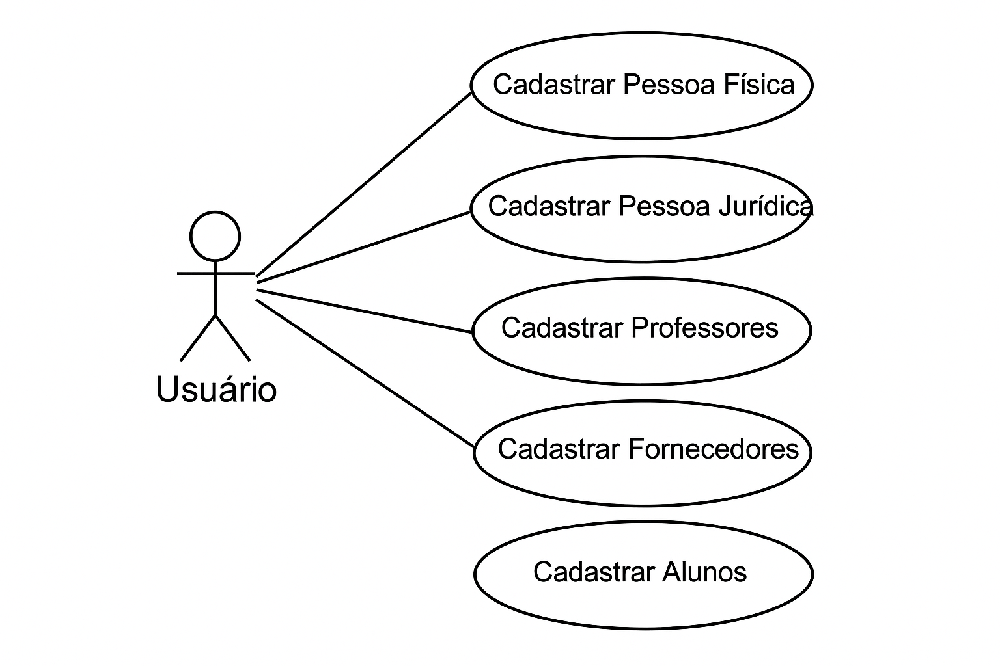
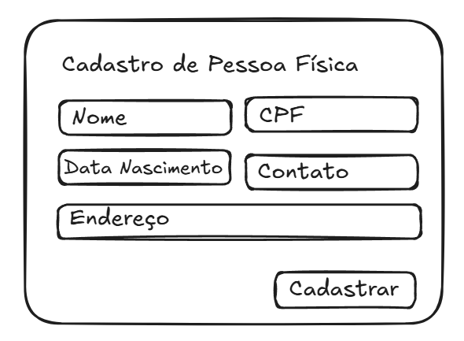
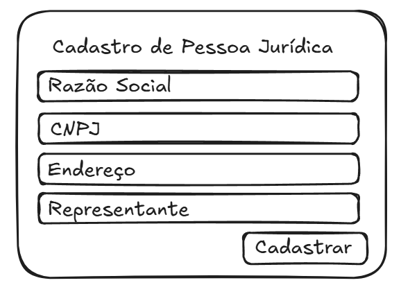
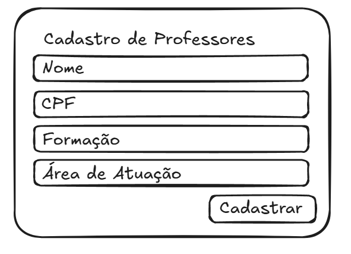
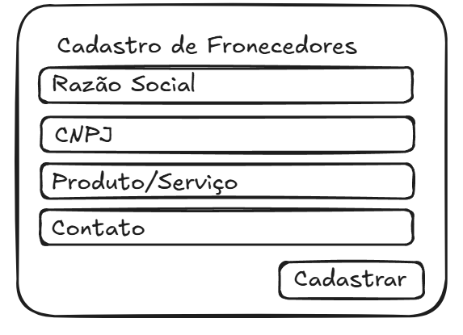
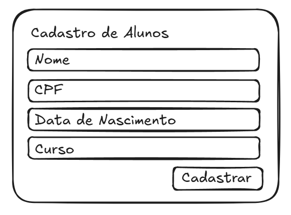

# 🎓 Projeto Integrador – SENAC

Este repositório contém os artefatos desenvolvidos nas **Fases 1 e 2** do Projeto Integrador do curso SENAC. O objetivo é construir um sistema completo, seguindo boas práticas de **engenharia de software**, **modelagem de requisitos** e **prototipação de interfaces**.

---

## 🧩 Fase 1 – Diagramas de Caso de Uso

Nesta fase, foi elaborado o **Diagrama de Casos de Uso** para representar as principais funcionalidades do sistema, bem como os atores envolvidos em cada processo.

### 🔍 Funcionalidades mapeadas:
- Cadastro de **Pessoa Física**
- Cadastro de **Pessoa Jurídica**
- Cadastro de **Professores**
- Cadastro de **Alunos**
- Cadastro de **Fornecedores**

### 📌 Diagrama de Casos de Uso: 
  

---

## 🎨 Protótipos Visuais – Fase 2
Na fase 2, foram criados **protótipos visuais em alta fidelidade**, representando as principais jornadas do usuário no sistema.  

👉 Todos os protótipos foram desenvolvidos no **Excalidraw** e exportados em imagens.  

- Tela de **Cadastro de Pessoa Física**  
  

- Tela de **Cadastro de Pessoa Jurídica**  
  

- Tela de **Cadastro de Professores**  
  

- Tela de **Cadastro de Fornecedores**  
  

- Tela de **Cadastro de Alunos**  
  

---

## 🚀 Como Visualizar
Acesse o link do **Excalidraw**: [https://excalidraw.com/#json=ZVz1jrxiCI2qk0T1SFzH1,1s1xVWdpEu-8HrBCknnaHA].  

---

## 👥 Equipe
- Luis Felipe Alves Fernandes 
- Flaviano Lacerda de Araujo
- Amanda Brandão de Souza
- Julia Soares Santos
